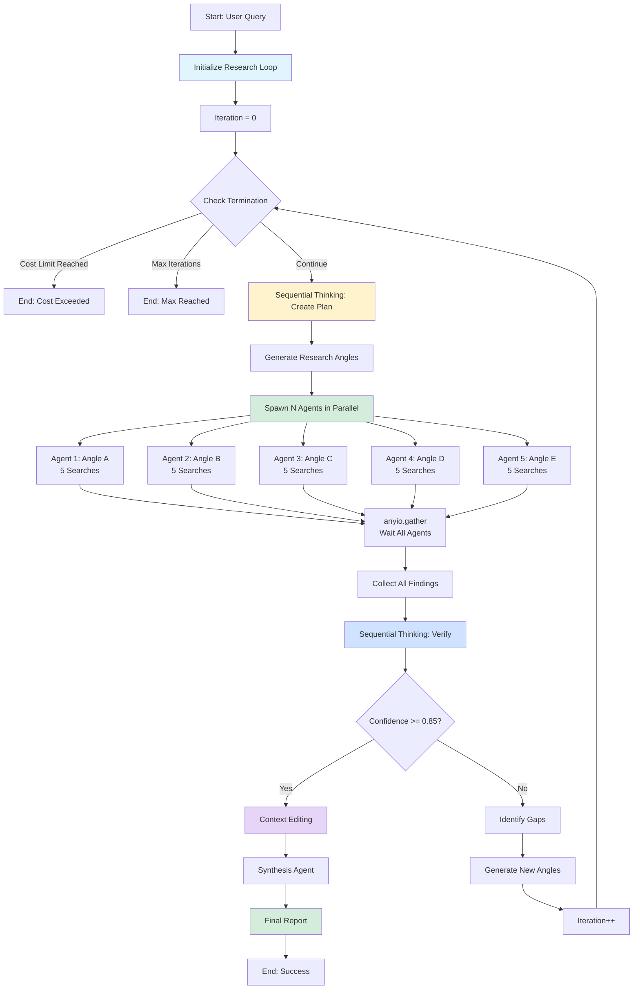
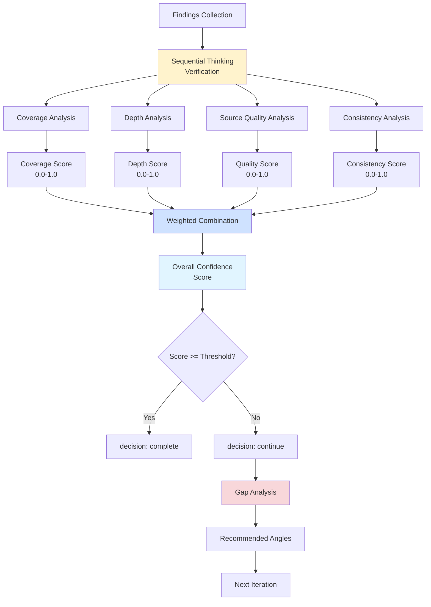
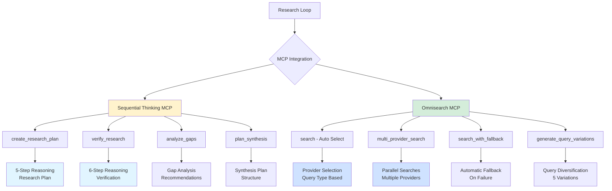
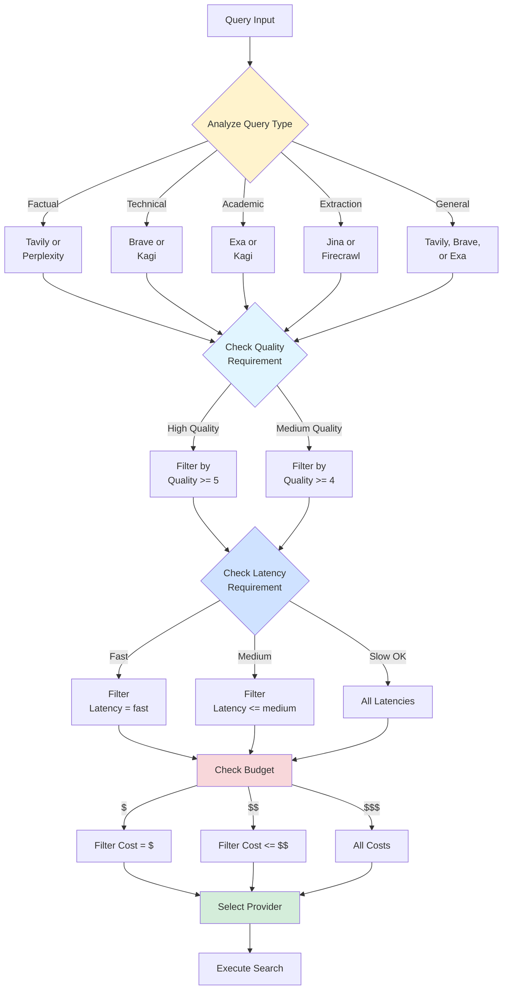
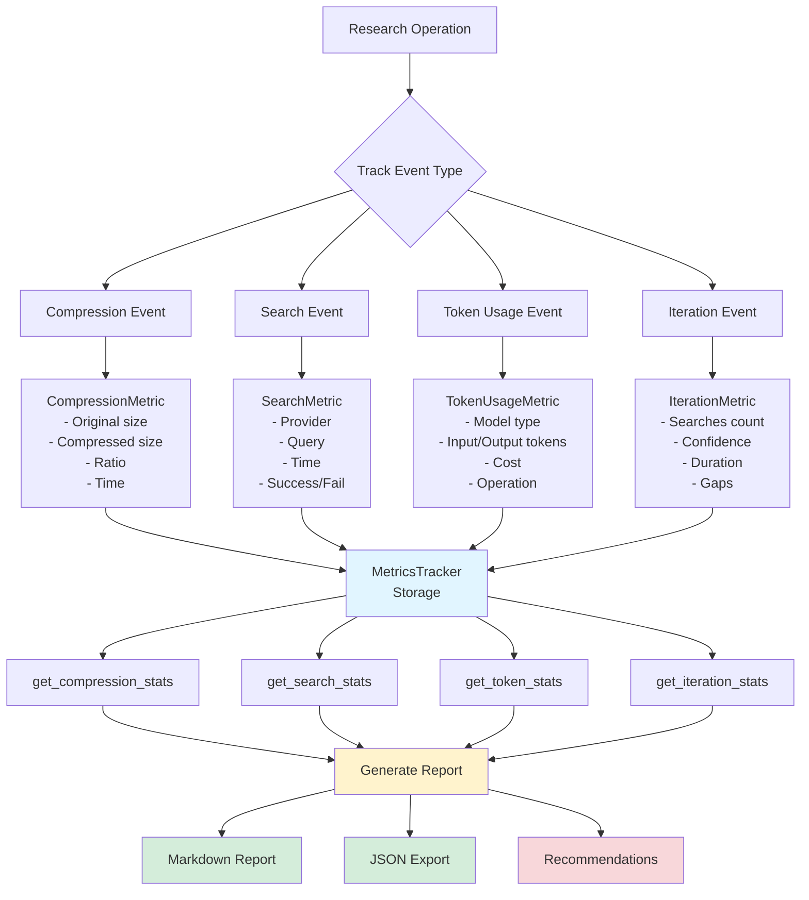
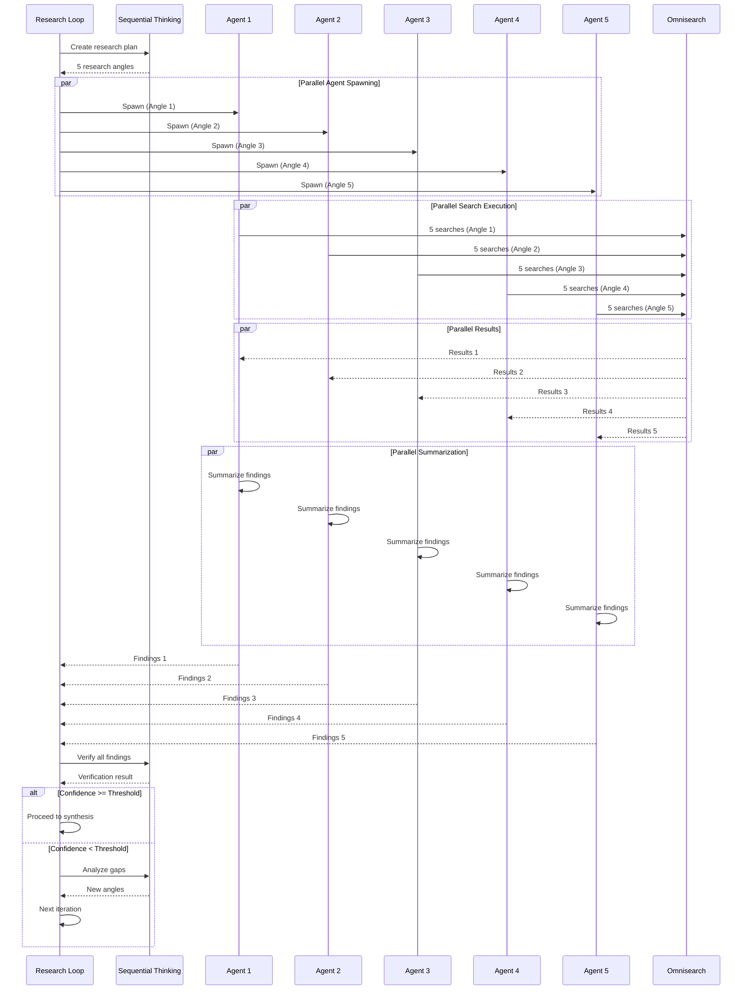
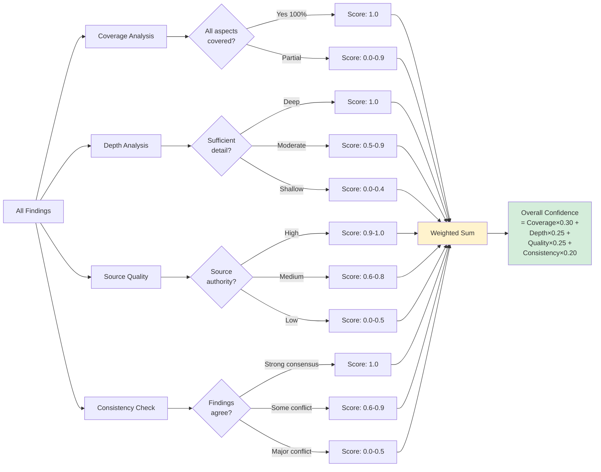
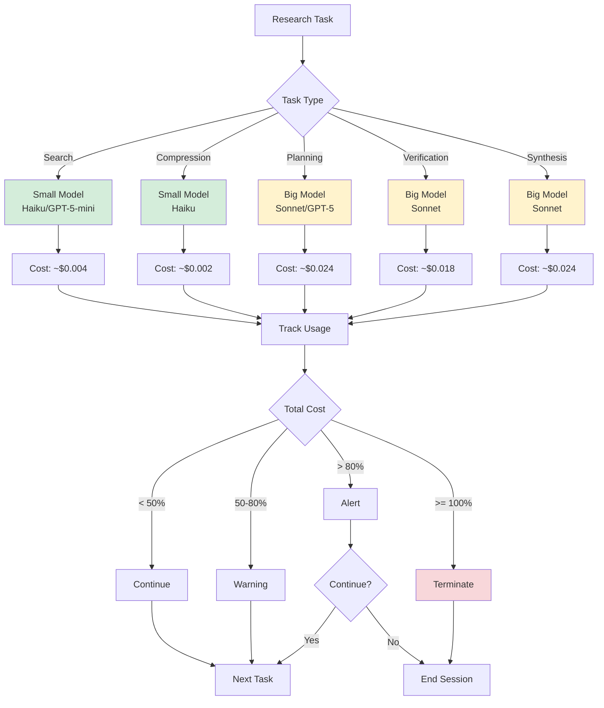
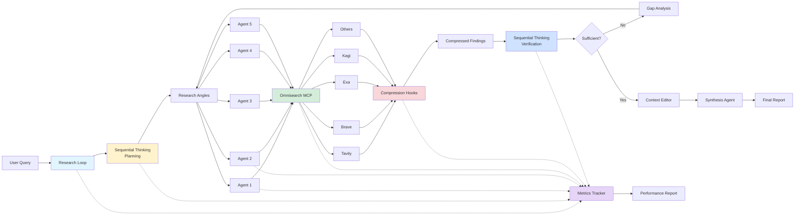

# Architecture Diagrams - Agentic Research System

## 1. Research Loop Flow Diagram

## 2. Verification Criteria Flow

## 3. MCP Integration Architecture

## 4. Provider Selection Logic

## 5. Metrics Tracking System

## 6. Parallel Agent Execution

## 7. Verification Scoring Details

## 8. Cost Optimization Flow

## 9. Data Flow Summary

## 10. System Components Overview

```mermaid
graph TD
    A[Agentic Research System] --> B[Core]
    A --> C[MCP]
    A --> D[Providers]
    A --> E[Agents]
    A --> F[Hooks]
    A --> G[Utils]

    B --> B1[research_loop.py<br/>Iterative loop logic]
    B --> B2[metrics.py<br/>Performance tracking]
    B --> B3[cost_tracker.py<br/>Cost monitoring]
    B --> B4[rate_limiter.py<br/>Rate limiting]

    C --> C1[omnisearch.py<br/>Search provider wrapper]
    C --> C2[sequential_thinking.py<br/>Reasoning wrapper]

    D --> D1[base.py<br/>Provider interface]
    D --> D2[claude_provider.py]
    D --> D3[openai_provider.py]
    D --> D4[gemini_provider.py]

    E --> E1[orchestrator.py<br/>Main coordinator]
    E --> E2[search_agent.py<br/>Search specialist]
    E --> E3[verification_agent.py<br/>Quality control]
    E --> E4[compression_agent.py<br/>Content compression]
    E --> E5[synthesis_agent.py<br/>Report generation]

    F --> F1[compression_hooks.py<br/>Auto compression]
    F --> F2[validation_hooks.py<br/>Pre-tool validation]
    F --> F3[context_hooks.py<br/>Context optimization]

    G --> G1[config_loader.py<br/>Configuration]
    G --> G2[provider_factory.py<br/>Provider creation]

    style B fill:#e1f5ff
    style C fill:#fff3cd
    style D fill:#d4edda
    style E fill:#cfe2ff
    style F fill:#f8d7da
    style G fill:#e7d5f7
```

---

## Key Architectural Principles

1. **Separation of Concerns**
   - Each module has a single, well-defined responsibility
   - Clear interfaces between components

2. **Parallel Execution**
   - Uses `anyio.gather()` for concurrent agent execution
   - Non-blocking I/O throughout

3. **Provider Agnostic**
   - BaseProvider abstraction allows any LLM
   - Easy switching between providers

4. **Cost Optimization**
   - Strategic model selection (big/small)
   - Automatic compression
   - Budget tracking and limits

5. **Quality Assurance**
   - Multi-criteria verification
   - Iterative improvement
   - Gap-based refinement

6. **Performance Monitoring**
   - Comprehensive metrics tracking
   - Optimization recommendations
   - JSON export for analysis
