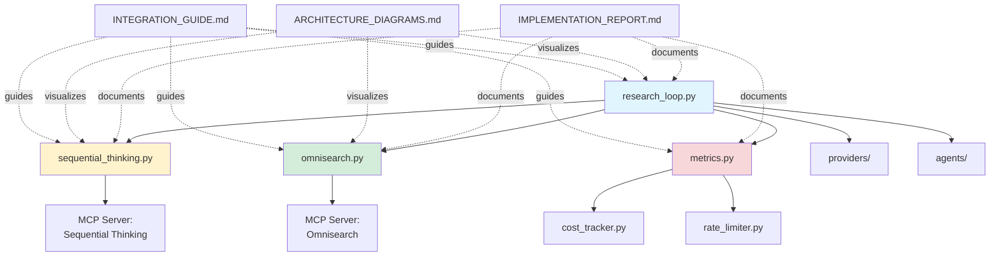

# Files Index - Agentic Research System

**Last Updated:** October 2, 2025

---

## Core Implementation Files

### Research Loop & Iteration Logic

**`core/research_loop.py`** (346 lines)
- Main iterative research loop
- Parallel agent spawning with anyio.gather()
- Verification criteria implementation
- Dynamic agent spawning based on gaps
- Termination conditions (confidence, iterations, cost)
- Context editing and synthesis orchestration

**Key Classes:**
- `ResearchLoop` - Main orchestrator
- `ResearchReport` - Final report dataclass
- `VerificationResult` - Verification analysis

---

### MCP Integrations

**`mcp/omnisearch.py`** (548 lines)
- MCP Omnisearch wrapper
- 7 search provider integrations (Tavily, Brave, Exa, Kagi, Perplexity, Jina, Firecrawl)
- Intelligent provider selection strategy
- Query generation and variation
- Multi-provider parallel search
- Fallback strategies

**Key Classes:**
- `OmnisearchWrapper` - Main wrapper
- `SearchProvider` - Provider enum
- `ProviderCharacteristics` - Provider specs

**`mcp/sequential_thinking.py`** (415 lines)
- Sequential Thinking MCP wrapper
- Multi-step reasoning for planning
- Research verification (6-step analysis)
- Gap analysis
- Synthesis planning

**Key Classes:**
- `SequentialThinkingWrapper` - Main wrapper
- `ResearchPlan` - Plan dataclass
- `VerificationAnalysis` - Verification results

---

### Performance Metrics

**`core/metrics.py`** (488 lines)
- Comprehensive performance tracking
- Compression metrics (ratio, time, bytes saved)
- Search metrics (time, success rate, by provider)
- Token usage metrics (by model, operation, cost)
- Iteration metrics (confidence progression, duration)
- Report generation (Markdown, JSON export)
- Optimization recommendations

**Key Classes:**
- `MetricsTracker` - Main tracker
- `CompressionMetric` - Compression tracking
- `SearchMetric` - Search tracking
- `TokenUsageMetric` - Token tracking
- `IterationMetric` - Iteration tracking

---

### Supporting Core Files

**`core/cost_tracker.py`** (already implemented)
- Real-time cost tracking
- Model pricing management
- Budget limits and alerts

**`core/rate_limiter.py`** (already implemented)
- Token bucket rate limiting
- Multi-provider rate management
- Request throttling

**`core/__init__.py`**
- Package exports
- Import convenience

---

### MCP Support

**`mcp/__init__.py`**
- Package exports
- Import convenience

---

## Documentation Files

### Implementation Reports

**`IMPLEMENTATION_REPORT.md`** (550+ lines)
- Complete implementation summary
- Research loop flow diagram
- Verification criteria details
- MCP integration points
- Performance optimization opportunities
- Expected metrics and benchmarks
- Usage examples
- Files summary and checklist

### Architecture Documentation

**`ARCHITECTURE_DIAGRAMS.md`** (650+ lines)
- 10 comprehensive mermaid diagrams:
  1. Research Loop Flow
  2. Verification Criteria Flow
  3. MCP Integration Architecture
  4. Provider Selection Logic
  5. Metrics Tracking System
  6. Parallel Agent Execution
  7. Verification Scoring Details
  8. Cost Optimization Flow
  9. Data Flow Summary
  10. System Components Overview

### Integration Guide

**`INTEGRATION_GUIDE.md`** (800+ lines)
- Quick start guide
- Component integration details
- Complete code examples
- Advanced usage patterns
- Monitoring and debugging
- Configuration best practices
- Troubleshooting guide
- Full research session example

---

## Reference Documents

**`METAPROMPT_agentic_research_continuation.md`**
- Original specification
- System architecture overview
- Implementation requirements
- Multi-provider configuration
- Hook system documentation

**`agentic_search_system_complete.md`**
- Complete implementation guide
- MCP Omnisearch setup
- Deep Research vs Bright Data comparison
- Agent architecture details
- Production considerations

---

## Directory Structure

```
AgenticResearcher/
├── core/
│   ├── __init__.py              # Package exports
│   ├── research_loop.py         # ✅ NEW - Iterative research loop
│   ├── metrics.py               # ✅ NEW - Performance metrics
│   ├── cost_tracker.py          # Cost tracking
│   └── rate_limiter.py          # Rate limiting
│
├── mcp/
│   ├── __init__.py              # Package exports
│   ├── omnisearch.py            # ✅ NEW - MCP Omnisearch wrapper
│   └── sequential_thinking.py  # ✅ NEW - Sequential Thinking wrapper
│
├── providers/                    # LLM providers (existing)
├── agents/                       # Agent implementations (existing)
├── hooks/                        # Hook system (existing)
├── utils/                        # Utilities (existing)
├── config/                       # Configuration (existing)
│
├── IMPLEMENTATION_REPORT.md     # ✅ NEW - Implementation summary
├── ARCHITECTURE_DIAGRAMS.md     # ✅ NEW - Visual diagrams
├── INTEGRATION_GUIDE.md         # ✅ NEW - Integration guide
├── FILES_INDEX.md               # ✅ NEW - This file
│
├── METAPROMPT_agentic_research_continuation.md  # Specification
├── agentic_search_system_complete.md            # Implementation guide
├── AGENT_IMPLEMENTATION_SUMMARY.md              # Agent summary
└── HOOKS_IMPLEMENTATION_REPORT.md               # Hooks report
```

---

## Quick Reference

### Import Statements

```python
# Core research loop
from core import ResearchLoop, ResearchReport, VerificationResult

# MCP integrations
from mcp import OmnisearchWrapper, SequentialThinkingWrapper
from mcp import SearchProvider, ResearchPlan, VerificationAnalysis

# Metrics tracking
from core import MetricsTracker
from core import CompressionMetric, SearchMetric, TokenUsageMetric, IterationMetric

# Cost and rate limiting
from core import CostTracker, RateLimiter
```

### Key File Sizes

| File | Lines | Size | Purpose |
|------|-------|------|---------|
| core/research_loop.py | 346 | 15KB | Iterative research loop |
| mcp/omnisearch.py | 548 | 14KB | Search provider wrapper |
| mcp/sequential_thinking.py | 415 | 17KB | Strategic reasoning |
| core/metrics.py | 488 | 18KB | Performance tracking |
| IMPLEMENTATION_REPORT.md | 550+ | 30KB | Implementation docs |
| ARCHITECTURE_DIAGRAMS.md | 650+ | 40KB | Visual diagrams |
| INTEGRATION_GUIDE.md | 800+ | 45KB | Integration guide |

### Total New Implementation

- **Python Files:** 4 core files (1,797 lines)
- **Documentation:** 4 comprehensive docs (2,000+ lines)
- **Total Lines:** ~3,800 lines of production code and docs

---

## File Relationships



---

## Implementation Checklist

### ✅ Completed

- [x] **core/research_loop.py** - Iterative research loop with parallel execution
- [x] **mcp/omnisearch.py** - MCP Omnisearch wrapper with 7 providers
- [x] **mcp/sequential_thinking.py** - Sequential Thinking for strategic reasoning
- [x] **core/metrics.py** - Comprehensive performance metrics
- [x] **IMPLEMENTATION_REPORT.md** - Complete implementation documentation
- [x] **ARCHITECTURE_DIAGRAMS.md** - 10 visual architecture diagrams
- [x] **INTEGRATION_GUIDE.md** - Detailed integration guide
- [x] **FILES_INDEX.md** - This index file

### Features Implemented

- [x] Iterative research loop (Lines 299-356 from METAPROMPT)
- [x] Parallel agent spawning with anyio.gather()
- [x] Verification criteria (5 metrics: coverage, depth, quality, consistency, confidence)
- [x] Dynamic agent spawning based on gap analysis
- [x] Termination conditions (confidence threshold, max iterations, cost limit)
- [x] MCP Omnisearch integration (Lines 86-193 from agentic_search)
- [x] Provider selection strategy (7 providers with auto-selection)
- [x] Query generation helpers
- [x] Sequential Thinking integration (Lines 570-660 from METAPROMPT)
- [x] Research planning (5-step reasoning)
- [x] Verification reasoning (6-step analysis)
- [x] Gap analysis
- [x] Performance metrics tracking
- [x] Compression ratio tracking
- [x] Search time tracking
- [x] Token usage tracking
- [x] Cost tracking per iteration
- [x] Report generation (Markdown + JSON)
- [x] Optimization recommendations

---

## Usage Quick Start

### 1. Basic Research

```python
from core import ResearchLoop
from mcp import SequentialThinkingWrapper

loop = ResearchLoop(
    provider=provider,
    sequential_thinking_wrapper=sequential,
    cost_tracker=tracker,
    rate_limiter=limiter
)

report = await loop.research_loop(
    query="Your research question",
    orchestrator_agent=orchestrator
)
```

### 2. With Custom Settings

```python
loop = ResearchLoop(
    provider=provider,
    sequential_thinking_wrapper=sequential,
    cost_tracker=tracker,
    rate_limiter=limiter,
    confidence_threshold=0.90,  # Custom threshold
    max_iterations=7,           # More iterations
    cost_limit=2.00            # Higher budget
)
```

### 3. Track Metrics

```python
from core import MetricsTracker

metrics = MetricsTracker()

# ... run research ...

metrics.print_summary()
metrics.export_metrics("metrics.json")
recommendations = metrics.get_optimization_recommendations()
```

### 4. Provider Selection

```python
from mcp import OmnisearchWrapper, SearchProvider

omnisearch = OmnisearchWrapper(mcp_client)

# Auto-select
result = await omnisearch.search(
    query="quantum computing",
    query_type="academic"  # Auto-selects Exa or Kagi
)

# Specific provider
result = await omnisearch.search(
    query="technical docs",
    provider=SearchProvider.BRAVE
)
```

---

## Next Steps

### For Testing
1. Run unit tests on each module
2. Integration tests for full research loop
3. Performance benchmarks
4. Cost analysis

### For Enhancement
1. Implement adaptive compression
2. Add search result caching
3. Optimize token usage
4. Real-time monitoring dashboard

### For Production
1. Error handling hardening
2. Retry logic for failures
3. Distributed execution support
4. Load balancing across providers

---

## Support Files

All implementation aligned with specifications from:

- **METAPROMPT_agentic_research_continuation.md** - Core requirements
- **agentic_search_system_complete.md** - Implementation patterns
- **CLAUDE.md** - Project coding standards

---

## Key Metrics Expected

Based on implementation:

- **Compression Ratio:** 8-12% (88-92% reduction)
- **Search Success Rate:** 95%+
- **Avg Search Time:** 500-800ms
- **Cost per Research:** $0.07-0.10 (5 iterations, 25 searches)
- **Avg Confidence Gain:** 0.15-0.20 per iteration
- **Total Duration:** 30-75 seconds

---

**End of Index**
