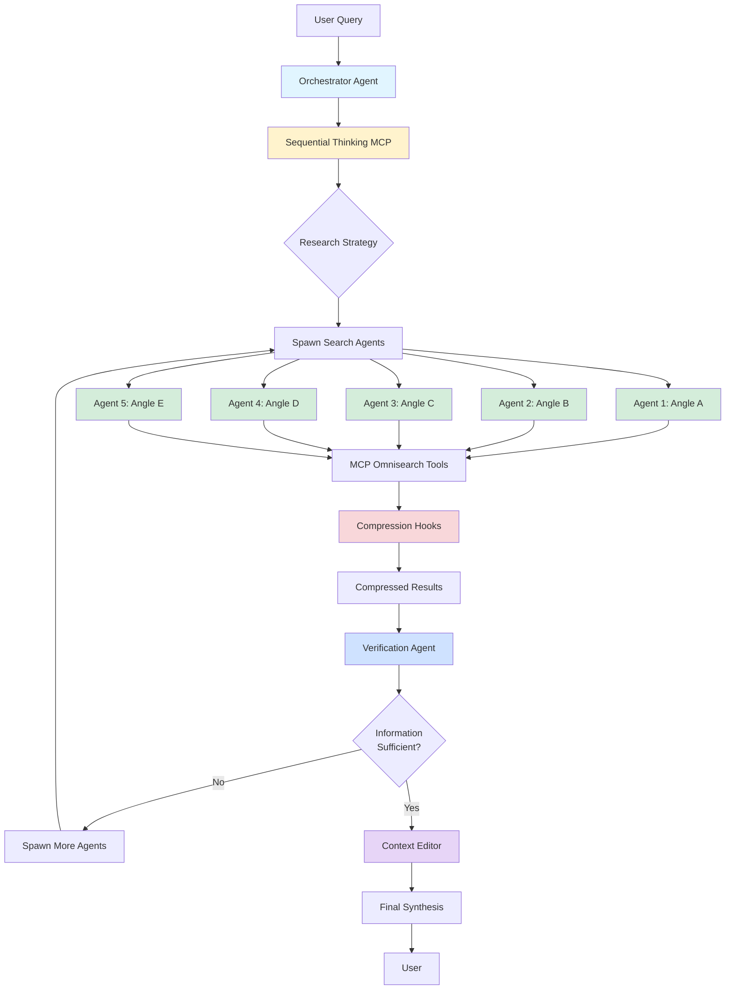

# 🔮 METAPROMPT: Agentic Research System - Multi-Provider Implementation

**Session Context Handoff Document**  
**Created:** October 2, 2025  
**Purpose:** Continue development of production-ready agentic research system with multi-provider support

---

## 📋 QUICK CONTEXT SUMMARY

We're building a **production-grade agentic research system** that:
1. Spawns parallel search agents for comprehensive research
2. Uses intelligent content compression hooks to stay within context limits
3. Implements iterative research loops (spawns more agents if information insufficient)
4. Supports **4 LLM providers** with big/small model strategies
5. Integrates MCP Omnisearch for unified search across 7+ providers
6. Uses **Sequential Thinking** MCP for verification and reasoning
7. Implements specialized verification agents for quality control

**Current State:** We have a complete conceptual design and implementation guide (see `agentic_search_system_complete.md`). Now we need to build it for real in Claude Code.

---

## 🎯 PROJECT GOALS

### Primary Objective
Build a **Claude Code project** that implements the agentic research system with:
- ✅ Multi-provider LLM support (Claude, OpenAI, OpenRouter, Gemini)
- ✅ Iterative research loops (spawn more agents until satisfied)
- ✅ Sequential thinking integration for verification
- ✅ Specialized verification agents
- ✅ Complete hook system for content compression
- ✅ Context editing capabilities from Claude Agent SDK
- ✅ Secure API key management via `secrets.json`
- ✅ MCP server configuration (Omnisearch + Sequential Thinking)

### Secondary Objectives
- 📁 Clean, focused file structure (small, efficient files)
- 🔄 No code duplication (specialized functions across files)
- 🔌 Easy provider switching (config-driven)
- 📊 Cost tracking and optimization
- 🧪 Testing and validation framework

---

## 📚 REQUIRED REFERENCE MATERIALS

### Primary Document
**File:** `agentic_search_system_complete.md`  
**Contains:**
- Complete architecture diagrams
- MCP Omnisearch setup and prompting guide
- Deep Research vs Bright Data comparison
- Full implementation code examples
- Hook system documentation
- Agent spawning methods

**You MUST read this document first to understand the base architecture.**

### Key Concepts to Extract
1. **Agent Architecture** - Orchestrator + Search Agents + Compression Agents
2. **Hook System** - Automatic content compression at tool boundaries
3. **Cost Optimization** - Model selection strategy (big for synthesis, small for searches)
4. **Parallel Execution** - Using `anyio.gather()` for concurrent agents
5. **MCP Integration** - How to use MCP Omnisearch tools

---

## 🏗️ ARCHITECTURE OVERVIEW

### System Components



### Agent Hierarchy

1. **Orchestrator Agent** (Big Model)
   - Role: Coordinate research, manage agent lifecycle
   - Tools: `spawn_agents`, `aggregate_results`, `edit_context`
   - Does NOT do synthesis (delegates to specialists)

2. **Sequential Thinking Agent** (Big Model)
   - Role: Strategic planning and reasoning
   - Uses: Sequential Thinking MCP server
   - Creates research plans, identifies angles

3. **Search Agents** (Small Model)
   - Role: Execute searches via MCP Omnisearch
   - Tools: `search_tavily`, `search_brave`, `search_exa`, etc.
   - Quantity: 5 agents per iteration

4. **Verification Agent** (Big Model)
   - Role: Quality control and sufficiency checking
   - Evaluates: Coverage, depth, source quality
   - Decision: Continue research or proceed to synthesis

5. **Compression Agents** (Small Model)
   - Role: Automatic content compression via hooks
   - Runs: After every search tool call
   - Target: 90-95% size reduction

6. **Context Editor Agent** (Big Model)
   - Role: Optimize context window using SDK editing features
   - Actions: Remove redundancy, prioritize content
   - Uses: Claude Agent SDK context editing API

7. **Synthesis Agent** (Big Model)
   - Role: Create final comprehensive report
   - Input: All compressed findings
   - Output: Markdown report

---

## 🔑 MULTI-PROVIDER CONFIGURATION

### Provider Strategy

We support 4 providers with big/small model pairing:

| Provider | Big Model (Orchestrator, Verification, Synthesis) | Small Model (Search, Compression) | API Key Env Var |
|----------|---------------------------------------------------|-----------------------------------|-----------------|
| **Claude** | `claude-sonnet-4-20250514` | `claude-haiku-3-5-20250307` | `ANTHROPIC_API_KEY` |
| **OpenAI** | `gpt-5` | `gpt-5-mini` | `OPENAI_API_KEY` |
| **OpenRouter** | `kimi-k2` | `qwen/qwen3-30b-a3b` | `OPENROUTER_API_KEY` |
| **Gemini** | `gemini-2.5-pro` | `gemini-2.5-flash` | `GOOGLE_API_KEY` |

### File Structure for Multi-Provider

```
project/
├── config/
│   ├── providers.json          # Provider configurations
│   ├── secrets.json            # API keys (gitignored)
│   └── mcp_servers.json        # MCP server configs
│
├── providers/
│   ├── __init__.py
│   ├── base.py                 # BaseProvider abstract class
│   ├── claude_provider.py      # Claude implementation
│   ├── openai_provider.py      # OpenAI implementation
│   ├── openrouter_provider.py  # OpenRouter implementation
│   └── gemini_provider.py      # Gemini implementation
│
├── agents/
│   ├── __init__.py
│   ├── orchestrator.py         # Main orchestrator
│   ├── search_agent.py         # Search specialist
│   ├── verification_agent.py   # Quality control
│   ├── compression_agent.py    # Content compression
│   ├── context_editor.py       # Context optimization
│   └── synthesis_agent.py      # Final report generation
│
├── hooks/
│   ├── __init__.py
│   ├── compression_hooks.py    # Content compression hooks
│   ├── validation_hooks.py     # Pre-tool validation
│   └── context_hooks.py        # Context management hooks
│
├── mcp/
│   ├── __init__.py
│   ├── omnisearch.py           # MCP Omnisearch wrapper
│   └── sequential_thinking.py  # Sequential Thinking wrapper
│
├── core/
│   ├── __init__.py
│   ├── research_loop.py        # Iterative research loop
│   ├── cost_tracker.py         # Cost monitoring
│   ├── rate_limiter.py         # Rate limit management
│   └── metrics.py              # Performance metrics
│
├── utils/
│   ├── __init__.py
│   ├── config_loader.py        # Load configs/secrets
│   ├── provider_factory.py     # Create providers
│   └── logging_config.py       # Logging setup
│
├── main.py                      # Entry point
├── requirements.txt             # Python dependencies
└── README.md                    # Documentation
```

### Provider Interface (Base Class)

Each provider must implement:

```python
from abc import ABC, abstractmethod
from typing import Dict, Any, List

class BaseProvider(ABC):
    """Abstract base class for LLM providers"""
    
    @abstractmethod
    async def create_agent(
        self,
        model_type: str,  # "big" or "small"
        system_prompt: str,
        tools: List[str] = None
    ) -> Any:
        """Create an agent instance"""
        pass
    
    @abstractmethod
    async def send_message(
        self,
        agent: Any,
        message: str,
        temperature: float = 0.3
    ) -> str:
        """Send message to agent and get response"""
        pass
    
    @abstractmethod
    async def call_tool(
        self,
        agent: Any,
        tool_name: str,
        arguments: Dict[str, Any]
    ) -> Dict[str, Any]:
        """Execute a tool call"""
        pass
    
    @abstractmethod
    def get_token_count(self, text: str) -> int:
        """Get token count for text"""
        pass
    
    @abstractmethod
    def get_cost(
        self,
        model_type: str,
        input_tokens: int,
        output_tokens: int
    ) -> float:
        """Calculate cost for usage"""
        pass
    
    @property
    @abstractmethod
    def big_model_name(self) -> str:
        """Name of big model"""
        pass
    
    @property
    @abstractmethod
    def small_model_name(self) -> str:
        """Name of small model"""
        pass
```

---

## 🔄 ITERATIVE RESEARCH LOOP

### Loop Logic

```python
async def research_loop(
    query: str,
    min_searches: int = 25,
    max_iterations: int = 5,
    confidence_threshold: float = 0.85
) -> ResearchReport:
    """
    Iterative research loop that continues until satisfied
    
    Process:
    1. Sequential Thinking creates initial research plan
    2. Spawn 5 search agents (25 searches total)
    3. Verification agent evaluates findings
    4. If insufficient (confidence < threshold):
       - Identify knowledge gaps
       - Generate new research angles
       - Spawn additional agents
       - Repeat
    5. Continue until:
       - Confidence threshold met, OR
       - Max iterations reached, OR
       - User manually stops
    6. Context editor optimizes final context
    7. Synthesis agent creates report
    """
    
    iteration = 0
    all_findings = []
    
    while iteration < max_iterations:
        # Sequential thinking for strategy
        research_plan = await sequential_thinking(query, all_findings)
        
        # Spawn agents
        new_findings = await spawn_search_agents(research_plan)
        all_findings.extend(new_findings)
        
        # Verification
        verification_result = await verify_sufficiency(all_findings, query)
        
        if verification_result.confidence >= confidence_threshold:
            break
        
        # Need more research
        print(f"📊 Iteration {iteration+1}: Confidence {verification_result.confidence:.2f}")
        print(f"🔍 Gaps identified: {verification_result.gaps}")
        
        iteration += 1
    
    # Context editing
    optimized_context = await edit_context(all_findings)
    
    # Final synthesis
    report = await synthesize_report(query, optimized_context)
    
    return report
```

### Verification Criteria

The verification agent checks:

1. **Coverage** - Are all aspects of the query addressed?
2. **Depth** - Is information sufficiently detailed?
3. **Source Quality** - Are sources authoritative and current?
4. **Consistency** - Do findings agree or are contradictions explained?
5. **Confidence** - Overall confidence score (0.0-1.0)

**Output Format:**
```json
{
  "confidence": 0.72,
  "coverage_score": 0.85,
  "depth_score": 0.60,
  "source_quality_score": 0.90,
  "consistency_score": 0.75,
  "gaps": [
    "Missing recent industry adoption data",
    "Limited coverage of implementation challenges",
    "Need more expert opinions"
  ],
  "recommended_angles": [
    "Industry case studies 2024-2025",
    "Technical implementation challenges",
    "Expert interviews and opinions"
  ],
  "decision": "continue"  // or "complete"
}
```

---

## 🪝 HOOK SYSTEM IMPLEMENTATION

### Required Hooks

#### 1. Compression Hook (POST_SEARCH)

```python
@hook("post_search")
async def compress_search_results(
    tool_name: str,
    result: Dict[str, Any],
    compression_agent: BaseProvider
) -> Dict[str, Any]:
    """
    Automatically compress search results
    
    Trigger: After any search tool (Tavily, Brave, Exa, etc.)
    Goal: Reduce content from 10KB+ to ~500 tokens
    Agent: Small model (Haiku/GPT-5-mini/etc)
    
    Returns: Compressed result with metadata
    """
    
    if "search" not in tool_name.lower():
        return result  # Not a search tool
    
    if len(str(result)) < 1000:
        return result  # Already small
    
    # Use compression agent
    compressed = await compression_agent.compress(
        content=result.get("content", ""),
        metadata={
            "url": result.get("url"),
            "title": result.get("title"),
            "query": result.get("query")
        }
    )
    
    # Return compressed with stats
    return {
        "url": result.get("url"),
        "title": result.get("title"),
        "compressed_content": compressed,
        "original_size": len(str(result)),
        "compressed_size": len(str(compressed)),
        "compression_ratio": len(str(compressed)) / len(str(result))
    }
```

#### 2. Validation Hook (PRE_TOOL)

```python
@hook("pre_tool")
async def validate_tool_call(
    tool_name: str,
    arguments: Dict[str, Any]
) -> bool:
    """
    Validate tool calls before execution
    
    Checks:
    - Query length (min 3 chars)
    - Rate limits
    - API key availability
    - Argument validity
    
    Returns: True to allow, False to block
    """
    
    # Validate search queries
    if "search" in tool_name:
        query = arguments.get("query", "")
        if len(query) < 3:
            print(f"❌ Query too short: '{query}'")
            return False
    
    # Check rate limits
    if not await rate_limiter.can_proceed():
        print("⏳ Rate limit reached, blocking tool call")
        return False
    
    # Check API keys
    if not config.has_required_key(tool_name):
        print(f"❌ Missing API key for {tool_name}")
        return False
    
    return True
```

#### 3. Context Optimization Hook (PRE_MESSAGE)

```python
@hook("pre_message")
async def optimize_context(
    messages: List[Dict],
    context_editor: BaseProvider
) -> List[Dict]:
    """
    Optimize context before sending to LLM
    
    Actions:
    - Remove duplicate URLs
    - Prioritize recent/relevant messages
    - Compress old messages
    - Keep total tokens under limit
    
    Uses: Claude Agent SDK context editing
    """
    
    # Remove duplicates
    seen_urls = set()
    unique_messages = []
    
    for msg in messages:
        url = msg.get("url")
        if url and url in seen_urls:
            continue
        if url:
            seen_urls.add(url)
        unique_messages.append(msg)
    
    # Check token count
    total_tokens = sum(get_token_count(str(msg)) for msg in unique_messages)
    
    if total_tokens < 150000:  # Under limit
        return unique_messages
    
    # Need to compress
    print(f"⚠️ Context too large ({total_tokens} tokens), optimizing...")
    
    # Use context editor
    optimized = await context_editor.edit_context(
        messages=unique_messages,
        target_tokens=100000,
        strategy="keep_recent_and_relevant"
    )
    
    return optimized
```

#### 4. Cost Tracking Hook (POST_MESSAGE)

```python
@hook("post_message")
async def track_costs(
    model: str,
    input_tokens: int,
    output_tokens: int,
    cost_tracker: CostTracker
):
    """
    Track costs after each message
    
    Records:
    - Token usage by model
    - Cost by provider
    - Running total
    
    Alerts if approaching budget limit
    """
    
    cost = provider.get_cost(model, input_tokens, output_tokens)
    
    cost_tracker.add_usage(
        model=model,
        input_tokens=input_tokens,
        output_tokens=output_tokens,
        cost=cost
    )
    
    # Alert if approaching limit
    if cost_tracker.total_cost > 0.50:  # $0.50 warning
        print(f"⚠️ Cost warning: ${cost_tracker.total_cost:.2f}")
```

---

## 🧠 SEQUENTIAL THINKING INTEGRATION

### MCP Server Setup

**Configuration** (`config/mcp_servers.json`):
```json
{
  "sequential-thinking": {
    "command": "npx",
    "args": [
      "-y",
      "@anthropic-ai/mcp-server-sequential-thinking"
    ],
    "env": {}
  },
  "mcp-omnisearch": {
    "command": "node",
    "args": [
      "/path/to/mcp-omnisearch/dist/index.js"
    ],
    "env": {
      "TAVILY_API_KEY": "${TAVILY_API_KEY}",
      "BRAVE_API_KEY": "${BRAVE_API_KEY}",
      "EXA_API_KEY": "${EXA_API_KEY}",
      "KAGI_API_KEY": "${KAGI_API_KEY}",
      "PERPLEXITY_API_KEY": "${PERPLEXITY_API_KEY}",
      "JINA_AI_API_KEY": "${JINA_AI_API_KEY}",
      "FIRECRAWL_API_KEY": "${FIRECRAWL_API_KEY}"
    }
  }
}
```

### Sequential Thinking Usage

```python
async def sequential_thinking_plan(
    query: str,
    existing_findings: List[Dict] = None
) -> ResearchPlan:
    """
    Use Sequential Thinking MCP to create research plan
    
    Process:
    1. Break down the query
    2. Identify key aspects
    3. Generate research angles
    4. Validate plan completeness
    5. Adjust based on existing findings
    """
    
    # Call Sequential Thinking tool
    result = await orchestrator.call_tool(
        "sequentialthinking",
        {
            "thought": f"""Analyze this research query and create a comprehensive plan.

Query: {query}

Existing findings summary: {summarize_findings(existing_findings) if existing_findings else "None"}

Think through:
1. What are the key aspects of this query?
2. What are 5 distinct angles that would provide comprehensive coverage?
3. For each angle, what specific information should we seek?
4. Are there gaps in existing findings that need addressing?
5. What's the optimal search strategy for each angle?

Output a research plan with 5 angles.""",
            "thoughtNumber": 1,
            "totalThoughts": 5,
            "nextThoughtNeeded": True
        }
    )
    
    # Process result into ResearchPlan
    plan = parse_research_plan(result)
    
    return plan
```

### When to Use Sequential Thinking

1. **Initial Planning** - Break down user query into angles
2. **Mid-Research Evaluation** - Assess progress and adjust strategy
3. **Gap Analysis** - Identify what's missing after each iteration
4. **Verification** - Quality check of findings
5. **Synthesis Planning** - Structure final report

**Key Principle:** Use Sequential Thinking for **strategic reasoning**, delegate execution to specialized agents.

---

## 🔐 SECRETS MANAGEMENT

### secrets.json Structure

```json
{
  "providers": {
    "claude": {
      "api_key": "sk-ant-api03-...",
      "enabled": true
    },
    "openai": {
      "api_key": "sk-proj-...",
      "enabled": true
    },
    "openrouter": {
      "api_key": "sk-or-v1-...",
      "enabled": false
    },
    "gemini": {
      "api_key": "AIzaSy...",
      "enabled": false
    }
  },
  "mcp_tools": {
    "tavily_api_key": "tvly-...",
    "brave_api_key": "BSA...",
    "exa_api_key": "...",
    "kagi_api_key": "...",
    "perplexity_api_key": "...",
    "jina_ai_api_key": "...",
    "firecrawl_api_key": "..."
  },
  "limits": {
    "max_cost_per_research": 1.00,
    "max_iterations": 5,
    "requests_per_minute": 50
  }
}
```

### Config Loader

```python
import json
from pathlib import Path
from typing import Dict, Any

class ConfigLoader:
    """Load configuration and secrets"""
    
    def __init__(self, secrets_path: str = "config/secrets.json"):
        self.secrets_path = Path(secrets_path)
        self._secrets = None
        self._load_secrets()
    
    def _load_secrets(self):
        """Load secrets from JSON file"""
        if not self.secrets_path.exists():
            raise FileNotFoundError(
                f"secrets.json not found at {self.secrets_path}\n"
                "Please create it using secrets.template.json"
            )
        
        with open(self.secrets_path) as f:
            self._secrets = json.load(f)
    
    def get_provider_key(self, provider: str) -> str:
        """Get API key for provider"""
        provider_config = self._secrets["providers"].get(provider)
        
        if not provider_config or not provider_config.get("enabled"):
            raise ValueError(f"Provider {provider} not enabled")
        
        return provider_config["api_key"]
    
    def get_mcp_key(self, tool_name: str) -> str:
        """Get API key for MCP tool"""
        key = self._secrets["mcp_tools"].get(f"{tool_name}_api_key")
        
        if not key:
            raise ValueError(f"No API key for {tool_name}")
        
        return key
    
    def get_limit(self, limit_name: str) -> Any:
        """Get configured limit"""
        return self._secrets["limits"].get(limit_name)
```

---

## 📝 IMPLEMENTATION CHECKLIST

### Phase 1: Foundation (Priority 1)
- [ ] Create project structure
- [ ] Implement `BaseProvider` abstract class
- [ ] Implement `ClaudeProvider` (reference implementation)
- [ ] Create `ConfigLoader` and `secrets.json` structure
- [ ] Set up MCP server configuration
- [ ] Implement basic cost tracking
- [ ] Create logging configuration

### Phase 2: Core Agents (Priority 1)
- [ ] Implement `OrchestratorAgent` (tool calls only)
- [ ] Implement `SearchAgent` (MCP Omnisearch integration)
- [ ] Implement `VerificationAgent` (quality control)
- [ ] Implement `CompressionAgent` (content compression)
- [ ] Implement `ContextEditorAgent` (SDK context editing)
- [ ] Implement `SynthesisAgent` (report generation)

### Phase 3: Hook System (Priority 1)
- [ ] Implement compression hook (post_search)
- [ ] Implement validation hook (pre_tool)
- [ ] Implement context optimization hook (pre_message)
- [ ] Implement cost tracking hook (post_message)
- [ ] Test hook execution order and priority

### Phase 4: Research Loop (Priority 1)
- [ ] Implement iterative research loop
- [ ] Implement verification criteria
- [ ] Implement gap analysis
- [ ] Implement dynamic agent spawning
- [ ] Test loop termination conditions

### Phase 5: Sequential Thinking (Priority 2)
- [ ] Set up Sequential Thinking MCP server
- [ ] Implement wrapper for Sequential Thinking calls
- [ ] Integrate with orchestrator for planning
- [ ] Add verification step using Sequential Thinking
- [ ] Test reasoning quality

### Phase 6: Multi-Provider Support (Priority 2)
- [ ] Implement `OpenAIProvider`
- [ ] Implement `OpenRouterProvider`
- [ ] Implement `GeminiProvider`
- [ ] Create `ProviderFactory` for provider selection
- [ ] Test provider switching
- [ ] Validate cost calculations per provider

### Phase 7: Testing & Optimization (Priority 3)
- [ ] Unit tests for each agent
- [ ] Integration tests for research loop
- [ ] Hook system tests
- [ ] Multi-provider tests
- [ ] Performance benchmarks
- [ ] Cost optimization analysis

### Phase 8: Documentation (Priority 3)
- [ ] API documentation
- [ ] Usage examples
- [ ] Configuration guide
- [ ] Troubleshooting guide
- [ ] Performance tuning guide

---

## 🚀 GETTING STARTED INSTRUCTIONS

When you (Claude) start the new session, follow these steps:

### Step 1: Read Reference Material
```
Read the file: agentic_search_system_complete.md

This contains the conceptual architecture, prompting guides, 
and implementation examples that this project is based on.
```

### Step 2: Understand Project Structure
```
Review the file structure defined in this metaprompt.
Understand the separation of concerns:
- providers/ = LLM provider implementations
- agents/ = Specialized agent types
- hooks/ = Hook system
- mcp/ = MCP server wrappers
- core/ = Research loop and utilities
```

### Step 3: Start with Foundation
```
Begin with Phase 1 (Foundation):
1. Create the project directory structure
2. Implement BaseProvider abstract class
3. Create secrets.json template
4. Implement ConfigLoader
5. Set up basic logging
```

### Step 4: Implement Claude Provider First
```
Claude is the reference implementation.
Once ClaudeProvider works, other providers follow the same pattern.

Key methods to implement:
- create_agent()
- send_message()
- call_tool()
- get_token_count()
- get_cost()
```

### Step 5: Build Core Agents
```
Implement agents in this order:
1. SearchAgent (simplest - just calls MCP tools)
2. CompressionAgent (small, focused task)
3. VerificationAgent (moderate complexity)
4. ContextEditorAgent (uses SDK context editing)
5. SynthesisAgent (uses big model for reports)
6. OrchestratorAgent (coordinates everything)
```

### Step 6: Implement Hook System
```
Hooks are decorators that wrap agent methods.
Start with compression hook (most critical for context limits).
Then add validation, context optimization, and cost tracking.
```

### Step 7: Build Research Loop
```
The research loop is the heart of the system.
Implement iterative logic with verification.
Ensure proper agent spawning and cleanup.
```

### Step 8: Add Sequential Thinking
```
Configure Sequential Thinking MCP server.
Integrate with orchestrator for strategic planning.
Use for verification and gap analysis.
```

### Step 9: Add More Providers
```
After Claude works, implement:
1. OpenAIProvider (similar API)
2. GeminiProvider (similar API)
3. OpenRouterProvider (OpenAI-compatible)
```

### Step 10: Test Everything
```
Create example research queries.
Test with different providers.
Validate cost tracking.
Check hook execution.
Ensure context limits are respected.
```

---

## 💡 KEY DESIGN DECISIONS

### Decision 1: Orchestrator Does Tool Calls Only
**Rationale:** Keep orchestrator lightweight and fast. Delegate heavy reasoning to Sequential Thinking MCP and specialized agents.

**Implementation:**
```python
class OrchestratorAgent:
    """Lightweight coordination agent"""
    
    async def research(self, query: str):
        # Use Sequential Thinking for plan
        plan = await self.call_tool("sequentialthinking", ...)
        
        # Spawn search agents
        agents = await self.call_tool("spawn_search_agents", ...)
        
        # Gather results
        results = await self.call_tool("gather_results", ...)
        
        # Verify
        verification = await self.call_tool("verify_sufficiency", ...)
        
        # Synthesize (delegate to synthesis agent)
        if verification["decision"] == "complete":
            report = await self.call_tool("synthesize_report", ...)
            return report
        else:
            # Continue research
            return await self.research_iteration(query, results)
```

### Decision 2: Hooks Over Manual Compression
**Rationale:** Automatic compression ensures consistency and removes cognitive burden from agents.

**Benefit:** Agents just do searches. Compression happens transparently.

### Decision 3: Multi-Provider via Abstract Base Class
**Rationale:** Clean abstraction allows easy provider switching without changing agent code.

**Pattern:**
```python
# Agent code is provider-agnostic
agent = provider.create_agent("small", system_prompt)
result = await provider.send_message(agent, query)

# Provider implementation handles the details
```

### Decision 4: Iterative Loop with Verification
**Rationale:** Single-pass research often misses important aspects. Iterative approach ensures comprehensive coverage.

**Exit Conditions:**
1. Verification confidence > threshold (e.g., 0.85)
2. Max iterations reached (e.g., 5)
3. User manual stop
4. Cost limit reached

### Decision 5: Context Editing for Long Research
**Rationale:** Long research sessions accumulate context. Claude Agent SDK's context editing allows intelligent pruning.

**Strategy:**
- Keep recent findings (last 2 iterations)
- Keep high-relevance findings
- Compress old findings
- Remove duplicates

### Decision 6: Small Files, No Duplication
**Rationale:** Maintainability and clarity. Each file has one clear purpose.

**Enforcement:**
- Max file size: 300 lines
- Shared functions go in utils/
- No copy-paste between providers

---

## 🎯 SUCCESS CRITERIA

The implementation is successful when:

### Functional Requirements ✅
- [ ] Can execute research with any of 4 providers
- [ ] Iterative loop spawns additional agents when needed
- [ ] Compression hooks reduce content by 90%+
- [ ] Verification agent accurately assesses sufficiency
- [ ] Sequential Thinking provides strategic guidance
- [ ] Context editing keeps token count under 150K
- [ ] Final reports are comprehensive and well-structured

### Performance Requirements ✅
- [ ] Single research iteration: < 2 minutes
- [ ] Complete research (3 iterations): < 5 minutes
- [ ] Cost per research: < $0.50
- [ ] Context efficiency: > 90% compression ratio
- [ ] Parallel search agents: 5 concurrent

### Quality Requirements ✅
- [ ] Code is clean, documented, and type-hinted
- [ ] No code duplication across providers
- [ ] All agents properly handle errors
- [ ] Secrets never logged or exposed
- [ ] Rate limits respected

### User Experience ✅
- [ ] Clear progress indicators
- [ ] Cost tracking displayed
- [ ] Easy provider switching (config change)
- [ ] Helpful error messages
- [ ] Markdown reports generated

---

## 🐛 POTENTIAL CHALLENGES & SOLUTIONS

### Challenge 1: Context Window Limits
**Problem:** Long research sessions hit context limits even with compression.

**Solution:**
- Implement aggressive compression (95% reduction)
- Use context editing to remove old findings
- Store findings externally, only keep summaries in context
- Implement "conversation reset" after each iteration

### Challenge 2: Rate Limits
**Problem:** Parallel agents trigger rate limits.

**Solution:**
- Implement rate limiter with token bucket algorithm
- Stagger agent spawning (0.5s delay between spawns)
- Respect provider-specific limits
- Fallback to sequential execution if rate limited

### Challenge 3: Provider API Differences
**Problem:** Each provider has different API patterns.

**Solution:**
- BaseProvider abstracts differences
- Provider-specific implementations handle edge cases
- Common patterns extracted to utils
- Comprehensive testing per provider

### Challenge 4: Cost Control
**Problem:** Iterative research can get expensive quickly.

**Solution:**
- Set hard cost limits in secrets.json
- Alert at 50% and 80% of budget
- Terminate research if limit reached
- Optimize model selection (use small models where possible)

### Challenge 5: Verification Quality
**Problem:** Verification agent might be too lenient or too strict.

**Solution:**
- Use Sequential Thinking for verification reasoning
- Implement multiple verification criteria (coverage, depth, quality)
- Allow user-configurable confidence thresholds
- Provide detailed verification reports

---

## 📖 EXAMPLE USAGE

### Simple Usage
```python
from main import AgenticResearchSystem

# Initialize with Claude provider
system = AgenticResearchSystem(provider="claude")

# Execute research
report = await system.research(
    query="What are the latest developments in quantum computing?",
    max_iterations=3
)

print(report)
```

### Advanced Usage with Config
```python
# Custom configuration
config = {
    "provider": "openai",
    "max_cost": 0.50,
    "confidence_threshold": 0.90,
    "compression_ratio": 0.95,
    "enable_sequential_thinking": True
}

system = AgenticResearchSystem(**config)

report = await system.research(
    query="Comprehensive analysis of global carbon capture technologies",
    max_iterations=5
)
```

### Provider Switching
```python
# Research with multiple providers for comparison
providers = ["claude", "openai", "gemini"]
reports = {}

for provider in providers:
    system = AgenticResearchSystem(provider=provider)
    reports[provider] = await system.research(query)

# Compare results
compare_reports(reports)
```

---

## 🔬 TESTING STRATEGY

### Unit Tests
```python
# Test each component in isolation
test_compression_hook()
test_verification_agent()
test_search_agent()
test_provider_factory()
test_config_loader()
```

### Integration Tests
```python
# Test components working together
test_research_loop()
test_multi_provider_switching()
test_hook_execution_order()
test_mcp_integration()
```

### End-to-End Tests
```python
# Test complete research workflows
test_simple_research_query()
test_iterative_research_loop()
test_cost_limit_enforcement()
test_context_editing()
```

### Performance Tests
```python
# Measure performance metrics
test_compression_ratio()
test_parallel_agent_speed()
test_context_token_count()
test_cost_per_research()
```

---

## 📚 ADDITIONAL RESOURCES

### Claude Agent SDK Documentation
- Context Editing: https://docs.claude.com/en/api/agent-sdk/context-editing
- Hooks: https://docs.claude.com/en/api/agent-sdk/hooks
- Subagents: https://docs.claude.com/en/api/agent-sdk/subagents

### MCP Resources
- MCP Omnisearch: https://github.com/spences10/mcp-omnisearch
- Sequential Thinking: https://github.com/anthropics/mcp-server-sequential-thinking
- MCP Specification: https://modelcontextprotocol.io

### Provider Documentation
- Claude API: https://docs.anthropic.com
- OpenAI API: https://platform.openai.com/docs
- OpenRouter: https://openrouter.ai/docs
- Gemini API: https://ai.google.dev/docs

---

## ✨ FINAL NOTES

This is an ambitious project with cutting-edge features:
- Multi-provider LLM support
- Iterative research loops
- Intelligent context management
- Production-grade hook system
- Sequential thinking integration

**Key Principles:**
1. **Start simple** - Get Claude provider working first
2. **Test thoroughly** - Each component should work independently
3. **Optimize progressively** - Start with basic compression, then refine
4. **Keep files small** - No file over 300 lines
5. **No duplication** - Shared code goes in utils/
6. **Security first** - Never expose API keys

**Success Mindset:**
- This is complex, take it step by step
- The reference document (agentic_search_system_complete.md) is your guide
- Each phase builds on the previous
- Test after each phase before moving on
- Celebrate small wins!

Good luck! 🚀

---

**Document Version:** 1.0  
**Last Updated:** October 2, 2025  
**Next Session Should Start With:** Reading agentic_search_system_complete.md
